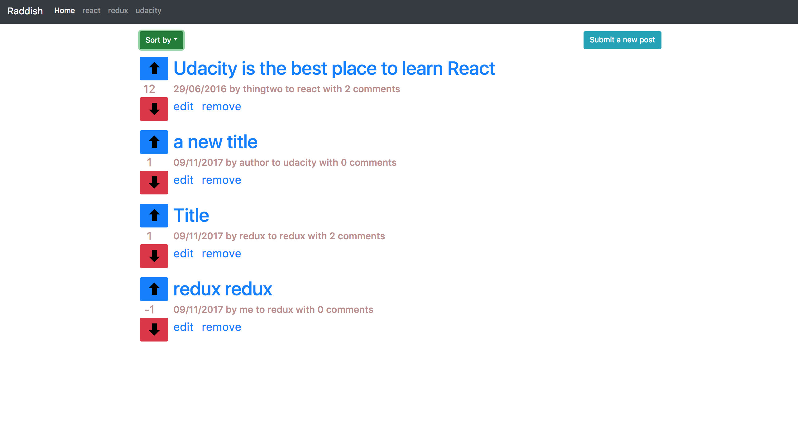
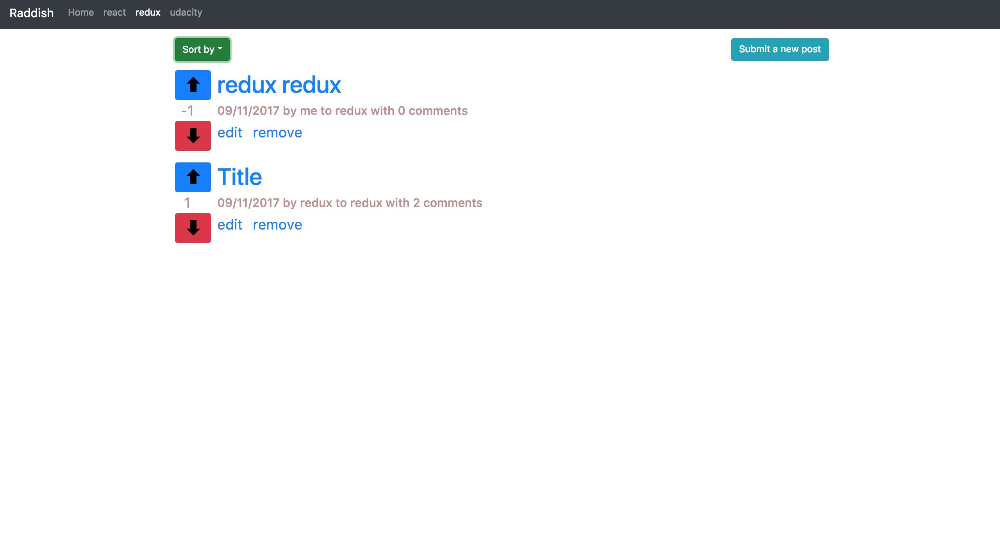

# Readable API Server

Readable is the second ReactJS project from Udacity. The purpose of the project is to build a forum with the abilities to post contents and comments. Users will be able to post content to predefined categories, comment on their posts and other users' posts, and vote on posts and comments. Users will also be able to edit and delete posts and comments.

This repository includes the code for the backend API Server that you'll use to develop and interact with the front-end portion of the project.

## Contributing

To get started developing right away:

* Install and start the API server
    - `cd api-server`
    - `npm install`
    - `node server`
* In another terminal window, use Create React App to scaffold out the front-end
    - `cd frontend`
    - `npm start`

# Frontend

This is the frontend of <b>Readable</b>. This project is built entirely with an awesome javascript library, namely ReactJS :). For visual UX frontend, I used HTML, CSS, and bootstrap.

## Implementation
To build the project, I followed some awesome React design patterns:
1. Composition
2. <a href="https://www.youtube.com/watch?v=YaZg8wg39QQ">High order component</a>
3. Thunk middleware

## API Server

Information about the API server and how to use it can be found in its [README file](api-server/README.md).

## License:

Readable  was created by Juan Karsten in 2017. It is a free software and may be distributed under <a  href="https://opensource.org/licenses/MIT">MIT License</a>.
